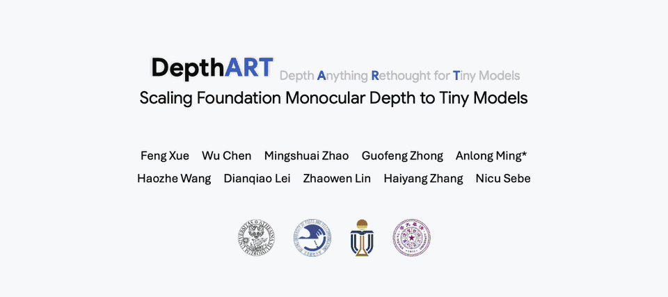

<p align="right">
  <a href="README.md"></a>
  <a href="README_zh-CN.md"></a>
</p>

<div align="center">

<h1>DepthART: Scaling Foundation Monocular Depth to Tiny Models</h1>

<p><strong>ACM Multimedia 2026</strong></p>

<p>
  <a href="https://xuefeng-cvr.github.io/DepthART/">
    
  </a>
  <a href="https://huggingface.co/Fengxue93/DepthART">
    
  </a>
  
</p>

<p>
  <em>Feng Xue</em> &bull; Wu Chen &bull; Mingshuai Zhao &bull; Guofeng Zhong &bull; Anlong Ming<br>
  Haozhe Wang &bull; Dianqiao Lei &bull; Zhaowen Lin &bull; Haiyang Zhang &bull; Nicu Sebe
</p>

<a href="depthart-intro.mp4">
  
</a>

<sub>点击预览可打开完整分辨率 MP4 视频。</sub>

</div>

## 项目简介

DepthART 将基础单目深度估计能力扩展到紧凑的 Small、Base 和 Large 模型。
本项目同时支持仿射不变相对深度和相机感知的度量深度，并为桌面 NVIDIA GPU
和 Jetson Orin NX 提供了优化后的推理路径。

| 任务 | 输入 | 输出 | 已发布模型 |
| --- | --- | --- | --- |
| 相对深度 | RGB 图像 | 仿射不变深度 | 224 和 448 分辨率的 S/B/L |
| 度量深度 | RGB 图像和相机内参 | 以米为单位的深度 | 448 分辨率的室内/室外 S/B/L |
| 部署 | 固定模型输入 | PyTorch 或 TensorRT 推理 | FP32/TF32、AMP 和 FP16 |

## 主要特性

- 支持 224x224 和 448x448 输入分辨率的相对深度模型。
- 支持相机内参条件化的室内和室外度量深度模型。
- 支持 PyTorch FP32/TF32 和 AMP 推理。
- 支持基于自定义 Selective Scan 插件的 TensorRT FP32 和 FP16 部署。
- 提供可复现的 PC 和 Jetson Orin NX 环境及部署脚本。

<a id="to-do-list"></a>
## 待办事项

当前公开版本提供推理、评测和部署代码，尚未包含训练代码与可复现的训练配置。

- [ ] 公开完整训练代码和可复现的训练配置。
- [ ] 完成 Jetson Nano 端到端全面测试，并公开部署说明与性能结果。
- [ ] 上线 DepthART 手机应用。

## 快速链接

- [预训练模型](https://huggingface.co/Fengxue93/DepthART)
- [项目主页](https://xuefeng-cvr.github.io/DepthART/)
- [环境安装](#installation)
- [相对深度与度量深度推理](#inference)
- [数据集评测](#dataset-evaluation)
- [精度与 A6000 性能](#results)
- [PC 与 Orin NX 部署](deploy/README.md)
- [待办事项](#to-do-list)
- [引用](#citation)

## 仓库结构

```text
DepthART/
├── assets/                   # README 媒体资源
├── checkpoints/              # 预训练相对深度和度量深度模型
├── relative/                 # 相对深度推理与评测
├── metric/                   # 度量深度推理与评测
├── deploy/
│   ├── shared/
│   │   ├── onnx/             # 完整 DepthART ONNX 图
│   │   ├── selective_scan/   # CUDA 算子和 TensorRT 插件
│   │   └── tests/            # 整网部署集成测试
│   ├── pc/                   # 桌面/服务器 NVIDIA GPU 工作流
│   └── orin_nx/              # Jetson Orin NX 工作流
├── environment.yml           # 可复现的 PC Conda 环境
└── CHECKSUMS.sha256          # checkpoint 校验和
```

## 模型

| 任务 | 场景 | 规模 | 输入 | Checkpoint |
| --- | --- | --- | --- | --- |
| 相对深度 | 通用 | S/B/L | 224x224 | `checkpoints/relative/depthart_relative_<s,b,l>_224.pth` |
| 相对深度 | 通用 | S/B/L | 448x448 | `checkpoints/relative/depthart_relative_<s,b,l>_448.pth` |
| 度量深度 | 室内 | S/B/L | 448 | `checkpoints/metric/depthart_metric_indoor_<s,b,l>_448.pth` |
| 度量深度 | 室外 | S/B/L | 448 | `checkpoints/metric/depthart_metric_outdoor_<s,b,l>_448.pth` |

## 预训练模型

相对深度和度量深度预训练模型托管在
[DepthART Hugging Face 仓库](https://huggingface.co/Fengxue93/DepthART)。

在已有的源码目录中下载完整 checkpoint 目录：

```bash
python -m pip install -U huggingface_hub
hf download Fengxue93/DepthART \
  --include "relative/**" \
  --include "metric/**" \
  --local-dir checkpoints
hf download Fengxue93/DepthART \
  --include "onnx/**" \
  --local-dir deploy/shared
sha256sum -c CHECKSUMS.sha256
```

Hugging Face 仓库包含 `relative/`、`metric/` 和 `onnx/` 三个顶层模型目录。
上述命令会将它们直接下载到模型表所示的运行路径和 `deploy/shared/onnx/`，
无需手动移动文件。TensorRT engine 是与设备相关的构建产物，不会作为 checkpoint
发布。

每个 checkpoint 都是仅用于推理的 PyTorch payload，只包含两个顶层字段：
`model` 保存模型 state dictionary，`validation_metrics` 只保存该模型已有的
验证指标摘要。Checkpoint 不包含优化器状态、训练参数、epoch、数据集划分条目、
图片路径或内部文件系统路径。

<a id="installation"></a>
## 环境安装

### PC

测试使用的 PC 环境定义在 [`environment.yml`](environment.yml) 中：
Python 3.9、PyTorch 2.1 和 CUDA 11.8。

```bash
conda env create -f environment.yml
conda activate depthart
```

为当前 GPU 编译 PyTorch Selective Scan 扩展：

```bash
MAX_JOBS=4 bash deploy/pc/setup.sh pytorch-only
```

如需 TensorRT 部署，请先安装包含 Python bindings、`NvInfer.h`、`libnvinfer`
和 `libnvinfer_plugin` 的 TensorRT 开发环境，然后执行：

```bash
MAX_JOBS=4 bash deploy/pc/setup.sh
```

仅通过 pip 安装的 TensorRT 包不包含 C++ 头文件，无法用于编译自定义插件。
完整依赖和问题排查方法见 [PC 部署说明](deploy/pc/README.md)。

### Jetson Orin NX

推荐的 Orin NX 环境使用 JetPack 6.2 和 NVIDIA PyTorch 25.06 容器。
完整容器配置定义在 [`deploy/orin_nx/Dockerfile`](deploy/orin_nx/Dockerfile) 中。

在 Orin NX 主机上执行：

```bash
cd DepthART
docker build -f deploy/orin_nx/Dockerfile -t depthart:orin-nx .

sudo nvpmodel -m 0
sudo jetson_clocks

docker run --rm -it \
  --runtime nvidia \
  --network host \
  --ipc host \
  -v "$PWD":/workspace/DepthART \
  -w /workspace/DepthART \
  depthart:orin-nx
```

在容器内编译 SM87 PyTorch 扩展和 TensorRT 插件：

```bash
MAX_JOBS=4 bash deploy/orin_nx/setup.sh
```

不要从 PC 复制 CUDA 扩展或 TensorRT engine。两者都必须在 Orin NX 上，
基于设备本地的 CUDA、PyTorch 和 TensorRT 版本重新构建。后续步骤见
[Orin NX 部署说明](deploy/orin_nx/README.md)。

<a id="inference"></a>
## 推理

以下两种推理命令都会保存 float32 NumPy 深度图和着色后的 PNG 图像。

### 相对深度

```bash
python relative/infer_image.py \
  --image assets/example.png \
  --encoder S \
  --resolution 224 \
  --checkpoint checkpoints/relative/depthart_relative_s_224.pth \
  --output outputs/relative_s_224.npy
```

相对深度预测具有仿射不变性，不应将其解释为实际距离。

### 度量深度

度量深度推理需要按照 `fx fy cx cy` 的顺序提供相机内参：

```bash
python metric/infer_image.py \
  --image assets/example.png \
  --encoder S \
  --domain indoor \
  --checkpoint checkpoints/metric/depthart_metric_indoor_s_448.pth \
  --intrinsics 525 525 319.5 239.5 \
  --output outputs/metric_indoor_s_448.npy
```

室内相机应使用 indoor checkpoint，室外场景应使用 outdoor checkpoint。
相机内参必须对应原始输入图像，预处理过程会随图像同步缩放内参。

<a id="dataset-evaluation"></a>
## 数据集评测

将 `DEPTHART_DATA_ROOT` 设置为受支持 zero-shot 数据集所在的目录：

```bash
export DEPTHART_DATA_ROOT=/path/to/Zero_shot_Datasets
python deploy/shared/evaluate_depth.py --output-dir outputs/evaluation
```

相对深度评测对每张图像进行 scale-and-shift 对齐；度量深度评测使用未经对齐的
绝对深度。评测脚本支持在 NYUD 和 KITTI 上测试全部已发布的 S/B/L 模型。

<a id="results"></a>
## 实验结果

### 深度精度

相对深度结果在有效 GT mask 上对每张图像进行仿射 scale-and-shift 对齐。
度量深度结果使用未经对齐的绝对深度，其中 NYUD 使用 indoor checkpoint，
KITTI 使用 outdoor checkpoint。`delta1` 越高越好，AbsRel 和 RMSE 越低越好。

#### 相对深度

| 模型 | 数据集 | 实际输入 | TF32 delta1 | TF32 AbsRel | TRT FP32 delta1 | TRT FP32 AbsRel | TRT FP16 delta1 | TRT FP16 AbsRel |
| --- | --- | --- | ---: | ---: | ---: | ---: | ---: | ---: |
| S224 | NYUD | 224x288 | 0.9531 | 0.0664 | 0.9531 | 0.0664 | 0.9529 | 0.0666 |
| S224 | KITTI | 224x736 | 0.9218 | 0.0867 | 0.9218 | 0.0867 | 0.9217 | 0.0868 |
| S448 | NYUD | 448x608 | 0.9642 | 0.0588 | 0.9642 | 0.0588 | 0.9642 | 0.0589 |
| S448 | KITTI | 448x1472 | 0.9298 | 0.0817 | 0.9297 | 0.0818 | 0.9291 | 0.0818 |
| B224 | NYUD | 224x288 | 0.9590 | 0.0620 | 0.9590 | 0.0620 | 0.9589 | 0.0619 |
| B224 | KITTI | 224x736 | 0.9216 | 0.0923 | 0.9215 | 0.0924 | 0.9215 | 0.0922 |
| B448 | NYUD | 448x608 | 0.9691 | 0.0555 | 0.9691 | 0.0555 | 0.9690 | 0.0556 |
| B448 | KITTI | 448x1472 | 0.9297 | 0.0876 | 0.9297 | 0.0876 | 0.9292 | 0.0879 |
| L224 | NYUD | 224x288 | 0.9666 | 0.0561 | 0.9666 | 0.0561 | 0.9662 | 0.0564 |
| L224 | KITTI | 224x736 | 0.9276 | 0.0882 | 0.9277 | 0.0882 | 0.9279 | 0.0881 |
| L448 | NYUD | 448x608 | 0.9707 | 0.0539 | 0.9707 | 0.0538 | 0.9706 | 0.0540 |
| L448 | KITTI | 448x1472 | 0.9315 | 0.0842 | 0.9315 | 0.0842 | 0.9316 | 0.0836 |

Relative-L-224 的 TensorRT FP16 模式将最终深度预测头保留为 FP32，
以避免发布 checkpoint 出现与输入相关的 FP16 溢出，同时骨干网络和解码器仍使用
FP16 执行。

#### 度量深度

| 模型 | 数据集 | 实际输入 | TF32 delta1 | TF32 RMSE (m) | TRT FP32 delta1 | TRT FP32 RMSE (m) | TRT FP16 delta1 | TRT FP16 RMSE (m) |
| --- | --- | --- | ---: | ---: | ---: | ---: | ---: | ---: |
| S448 | NYUD | 480x640 | 0.9234 | 0.3353 | 0.9234 | 0.3355 | 0.9232 | 0.3364 |
| S448 | KITTI | 448x1472 | 0.9489 | 3.0189 | 0.9490 | 3.0165 | 0.9483 | 3.0270 |
| B448 | NYUD | 480x640 | 0.9420 | 0.3075 | 0.9421 | 0.3074 | 0.9420 | 0.3071 |
| B448 | KITTI | 448x1472 | 0.9499 | 2.9462 | 0.9499 | 2.9455 | 0.9502 | 2.9415 |
| L448 | NYUD | 480x640 | 0.9459 | 0.2953 | 0.9459 | 0.2952 | 0.9439 | 0.3006 |
| L448 | KITTI | 448x1472 | 0.9575 | 2.7652 | 0.9576 | 2.7640 | 0.9583 | 2.7663 |

完整的各后端精度记录、checkpoint 路径、engine 路径、样本数量和评测协议见
[`backend_depth_metrics.csv`](deploy/pc/results/a6000/depth_eval/backend_depth_metrics.csv)。
保留三位小数的 PyTorch checkpoint 结果见
[`depth_metrics.csv`](deploy/pc/results/a6000/depth_eval/depth_metrics.csv)。

### A6000 推理性能

以下结果在 NVIDIA RTX A6000 上测得，batch size 为 1，预热 200 次，正式计时
1000 个样本。Model-only latency 使用 CUDA events，只统计模型推理，不包含图像解码、
CPU 预处理、Host-to-Device 传输、输出传输和输出尺寸恢复。FPS 按
`1000 / model-only latency (ms)` 计算。End-to-end latency 使用 wall-clock 计时，
覆盖从确定性 640x480 RGB 样本开始，经过 CPU resize 与归一化、Host-to-Device
传输、模型推理、Device-to-Host 传输，以及将深度恢复到 640x480 的完整流程。

#### 相对深度

| 模型 | 后端 | Model-only (ms) | FPS | E2E (ms) | Peak (MiB) |
| --- | --- | ---: | ---: | ---: | ---: |
| S224 | PyTorch FP32/TF32 | 1.690 | 591.9 | 2.586 | 50.7 |
| S224 | PyTorch AMP | 2.286 | 437.4 | 3.169 | 50.6 |
| S224 | TensorRT FP32 | 1.295 | 772.5 | 2.133 | 11.0 |
| S224 | TensorRT FP16 | 0.918 | 1088.9 | 1.775 | 11.0 |
| S448 | PyTorch FP32/TF32 | 2.937 | 340.5 | 5.860 | 59.3 |
| S448 | PyTorch AMP | 3.024 | 330.7 | 5.886 | 58.9 |
| S448 | TensorRT FP32 | 2.118 | 472.2 | 5.118 | 19.6 |
| S448 | TensorRT FP16 | 1.355 | 738.0 | 4.235 | 19.6 |
| B224 | PyTorch FP32/TF32 | 1.817 | 550.3 | 2.685 | 71.2 |
| B224 | PyTorch AMP | 2.496 | 400.6 | 3.377 | 71.1 |
| B224 | TensorRT FP32 | 1.432 | 698.2 | 2.280 | 11.0 |
| B224 | TensorRT FP16 | 1.002 | 997.6 | 1.853 | 11.0 |
| B448 | PyTorch FP32/TF32 | 3.356 | 297.9 | 6.310 | 79.8 |
| B448 | PyTorch AMP | 3.406 | 293.6 | 6.308 | 79.5 |
| B448 | TensorRT FP32 | 2.429 | 411.8 | 5.559 | 19.6 |
| B448 | TensorRT FP16 | 1.485 | 673.2 | 4.342 | 19.6 |
| L224 | PyTorch FP32/TF32 | 2.448 | 408.5 | 3.341 | 152.7 |
| L224 | PyTorch AMP | 3.212 | 311.4 | 4.147 | 152.6 |
| L224 | TensorRT FP32 | 2.014 | 496.5 | 2.868 | 11.0 |
| L224 | TensorRT FP16 | 1.309 | 764.2 | 2.130 | 11.0 |
| L448 | PyTorch FP32/TF32 | 5.015 | 199.4 | 7.876 | 162.7 |
| L448 | PyTorch AMP | 4.641 | 215.5 | 7.571 | 162.4 |
| L448 | TensorRT FP32 | 3.798 | 263.3 | 6.654 | 19.6 |
| L448 | TensorRT FP16 | 2.133 | 468.8 | 4.980 | 19.6 |

#### 度量深度

| 模型 | 后端 | Model-only (ms) | FPS | E2E (ms) | Peak (MiB) |
| --- | --- | ---: | ---: | ---: | ---: |
| S448 | PyTorch FP32/TF32 | 9.065 | 110.3 | 12.104 | 91.7 |
| S448 | PyTorch AMP | 4.750 | 210.5 | 7.620 | 91.3 |
| S448 | TensorRT FP32 | 6.364 | 157.1 | 9.301 | 19.6 |
| S448 | TensorRT FP16 | 2.558 | 391.0 | 5.425 | 19.6 |
| B448 | PyTorch FP32/TF32 | 9.858 | 101.4 | 12.829 | 121.1 |
| B448 | PyTorch AMP | 5.197 | 192.4 | 8.084 | 120.7 |
| B448 | TensorRT FP32 | 6.743 | 148.3 | 9.697 | 19.6 |
| B448 | TensorRT FP16 | 2.701 | 370.3 | 5.581 | 19.6 |
| L448 | PyTorch FP32/TF32 | 12.155 | 82.3 | 15.264 | 220.2 |
| L448 | PyTorch AMP | 6.552 | 152.6 | 9.436 | 219.9 |
| L448 | TensorRT FP32 | 8.227 | 121.6 | 11.229 | 19.6 |
| L448 | TensorRT FP16 | 3.369 | 296.8 | 6.339 | 19.6 |

峰值显存使用 `torch.cuda.max_memory_allocated()` 统计。TensorRT 行仅包含 PyTorch
可见的内存分配，不代表 engine 或 CUDA context 的总显存占用。完整的未舍入结果、
百分位数、软件版本、验证字段和产物路径见
[`summary.csv`](deploy/pc/results/a6000/summary.csv)。

## 性能测试

性能测试覆盖 PyTorch FP32/TF32、PyTorch AMP、TensorRT FP32 和 TensorRT FP16。
正式协议使用 batch size 1、200 次预热和 1000 个计时样本。

PC：

```bash
bash deploy/pc/benchmark.sh \
  --stage all --samples 1000 --warmup 200 --workspace-gb 8
```

Orin NX：

```bash
bash deploy/orin_nx/benchmark.sh \
  --stage all --samples 1000 --warmup 200 --workspace-gb 4
```

可通过 `--stage build`、`--stage benchmark` 和 `--stage summary` 从不同阶段继续执行。
输出目录和计时定义见 [`deploy/README.md`](deploy/README.md)。

## 验证仓库

```bash
python verify_release.py --allow-build-artifacts
```

该脚本会检查 checkpoint 清单、结果表、ONNX 图和自定义 Selective Scan 节点，
同时允许 setup 脚本在本机生成的动态库。发布维护者应在干净源码目录中去掉
`--allow-build-artifacts` 参数执行检查后再发布。

<a id="citation"></a>
## 引用

如果 DepthART 对您的研究有帮助，请引用：

```bibtex
@inproceedings{depthart2026,
  title     = {DepthART: Scaling Foundation Monocular Depth to Tiny Models},
  author    = {Feng Xue and Wu Chen and Mingshuai Zhao and Guofeng Zhong and Anlong Ming and Haozhe Wang and Dianqiao Lei and Zhaowen Lin and Haiyang Zhang and Nicu Sebe},
  booktitle = {ACM Multimedia},
  year      = {2026}
}
```
