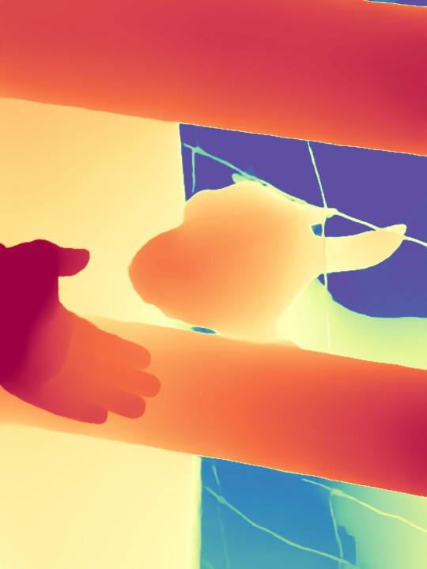
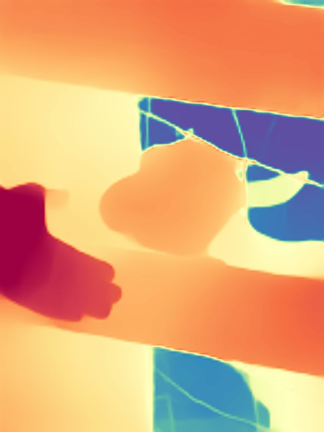
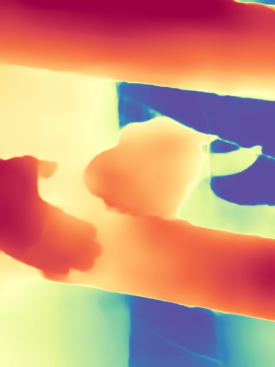
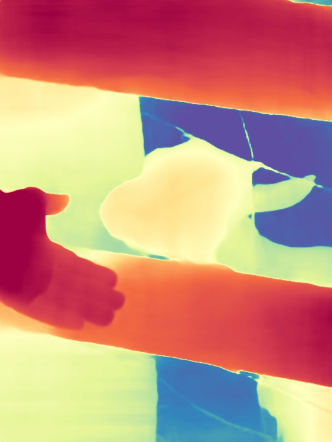
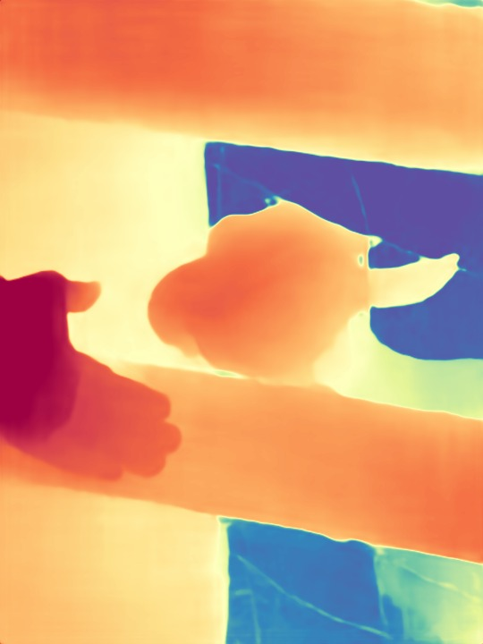
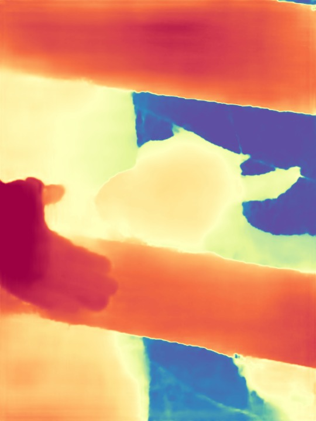
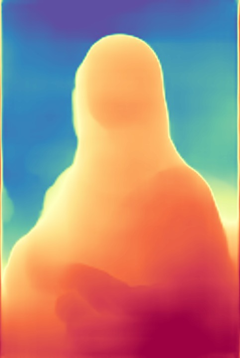
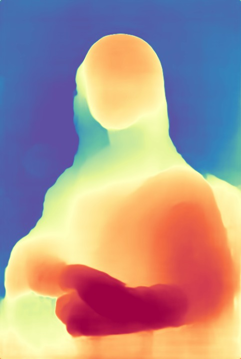
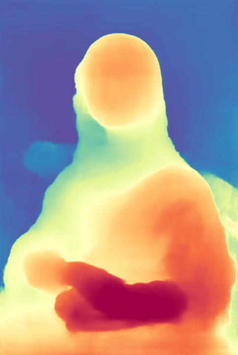

<p align="right">
  <a href="README.md"></a>
  <a href="README_zh-CN.md"></a>
</p>

<div align="center">

<h1>DepthART: Scaling Foundation Monocular Depth to Tiny Models</h1>

<p><strong>ACM Multimedia 2026</strong></p>

<p>
  <a href="https://xuefeng-cvr.github.io/DepthART/">
    
  </a>
  <a href="https://huggingface.co/Fengxue93/DepthART">
    
  </a>
  <a href="https://arxiv.org/abs/2607.17099">
    
  </a>
</p>

<p>
  <em>Feng Xue</em> &bull; Wu Chen &bull; Mingshuai Zhao &bull; Guofeng Zhong &bull; Anlong Ming<br>
  Haozhe Wang &bull; Dianqiao Lei &bull; Zhaowen Lin &bull; Haiyang Zhang &bull; Nicu Sebe
</p>

<a href="depthart-intro.mp4">
  
</a>

<sub>点击预览可打开完整分辨率 MP4 视频。</sub>

</div>

## 🔎 项目简介

DepthART 将基础单目深度估计能力扩展到紧凑的 Small、Base 和 Large 模型。
本项目同时支持仿射不变相对深度和相机感知的度量深度，并为桌面 NVIDIA GPU
和 Jetson Orin NX 提供了优化后的推理路径。

| 任务 | 输入 | 输出 | 已发布模型 |
| --- | --- | --- | --- |
| 相对深度 | RGB 图像 | 仿射不变深度 | 224 和 448 分辨率的 TinyViM S/B/L 与 MobileNetV4 系列 |
| 度量深度 | RGB 图像和相机内参 | 以米为单位的深度 | 448 分辨率的室内/室外 S/B/L |
| 部署 | 固定模型输入 | PyTorch 或 TensorRT 推理 | FP32/TF32、AMP 和 FP16 |

## 📰 新闻

- **2026 年 9 月：** 我们发布了更易部署的 DepthART MobileNetV4-S 和
  MobileNetV4-M，面向使用 BPU、NPU 等加速器的早期移动设备及其他资源受限平台。
  此外还提供 MobileNetV4-M-slim-SPF：它裁剪了 MobileNetV4-M 主干，并将 DPT
  解码器重新设计为计算更轻量的单路径金字塔融合（SPF）解码器，在深度质量和
  推理速度之间取得更均衡的表现。

## ✨ 主要特性

- 支持 224x224 和 448x448 输入分辨率的相对深度模型。
- 支持 TinyViM S/B/L、MobileNetV4-S/M 和 MobileNetV4-M-slim-SPF 编码器。
- 支持相机内参条件化的室内和室外度量深度模型。
- 支持 PyTorch FP32/TF32 和 AMP 推理。
- 支持基于自定义 Selective Scan 插件的 TensorRT FP32 和 FP16 部署。
- 提供可复现的 PC 和 Jetson Orin NX 环境及部署脚本。

<a id="to-do-list"></a>
## 📋 待办事项

当前公开版本提供推理、评测和部署代码，尚未包含训练代码与可复现的训练配置。

- [ ] 公开完整训练代码和可复现的训练配置。
- [ ] 完成 Jetson Nano 端到端全面测试，并公开部署说明与性能结果。
- [ ] 上线 DepthART 手机应用。
- [x] 补充部署更友好的 MobileNetV4 DepthART 模型。

## 🔗 快速链接

- [预训练模型](https://huggingface.co/Fengxue93/DepthART)
- [项目主页](https://xuefeng-cvr.github.io/DepthART/)
- [环境安装](#installation)
- [相对深度与度量深度推理](#inference)
- [数据集评测](#dataset-evaluation)
- [精度与 A6000 性能](#results)
- [PC 与 Orin NX 部署](deploy/README.md)
- [待办事项](#to-do-list)
- [引用](#citation)

## 🗂️ 仓库结构

```text
DepthART/
├── assets/                   # README 媒体资源
├── checkpoints/              # 预训练相对深度和度量深度模型
├── relative/                 # 相对深度模型、推理与评测
├── metric/                   # 度量深度推理与评测
├── deploy/
│   ├── shared/
│   │   ├── onnx/             # 完整 DepthART ONNX 图
│   │   ├── selective_scan/   # CUDA 算子和 TensorRT 插件
│   │   └── tests/            # 整网部署集成测试
│   ├── pc/                   # 桌面/服务器 NVIDIA GPU 工作流
│   └── orin_nx/              # Jetson Orin NX 工作流
├── environment.yml           # 可复现的 PC Conda 环境
└── CHECKSUMS.sha256          # checkpoint 与 ONNX 校验和
```

## 🧩 模型

| 任务 | 场景 | 规模 | 输入 | Checkpoint |
| --- | --- | --- | --- | --- |
| 相对深度 | 通用 | S/B/L | 224x224 | `checkpoints/relative/depthart_relative_<s,b,l>_224.pth` |
| 相对深度 | 通用 | S/B/L | 448x448 | `checkpoints/relative/depthart_relative_<s,b,l>_448.pth` |
| 相对深度 | 通用 | MobileNetV4-S/M | 224x224 或 448x448 | `checkpoints/relative/depthart_relative_mnv4<s,m>_<224,448>.pth` |
| 相对深度 | 通用 | MobileNetV4-M-slim-SPF | 224x224 或 448x448 | `checkpoints/relative/depthart_relative_mnv4m_slim_<224,448>.pth` |
| 度量深度 | 室内 | S/B/L | 448 | `checkpoints/metric/depthart_metric_indoor_<s,b,l>_448.pth` |
| 度量深度 | 室外 | S/B/L | 448 | `checkpoints/metric/depthart_metric_outdoor_<s,b,l>_448.pth` |

## 📦 预训练模型

相对深度和度量深度预训练模型托管在
[DepthART Hugging Face 仓库](https://huggingface.co/Fengxue93/DepthART)。
模型 checkpoint 与 ONNX 图不存放在 GitHub 仓库中；克隆源码后，请从
Hugging Face 下载这些文件。

在已有的源码目录中下载完整 checkpoint 目录：

```bash
python -m pip install -U huggingface_hub
hf download Fengxue93/DepthART \
  --include "relative/**" \
  --include "metric/**" \
  --local-dir checkpoints
hf download Fengxue93/DepthART \
  --include "onnx/**" \
  --local-dir deploy/shared
sha256sum -c CHECKSUMS.sha256
```

Hugging Face 仓库包含 `relative/`、`metric/` 和 `onnx/` 三个顶层模型目录。
上述命令会将它们直接下载到模型表所示的运行路径和 `deploy/shared/onnx/`，
无需手动移动文件。TensorRT engine 是与设备相关的构建产物，不会作为 checkpoint
发布。`CHECKSUMS.sha256` 覆盖全部 18 个 checkpoint 和 18 个 ONNX 图，其中包括
6 个仅使用标准算子的 MobileNetV4 ONNX 图。

每个 checkpoint 都是仅用于推理的 PyTorch payload，只包含两个顶层字段：
`model` 保存模型 state dictionary，`validation_metrics` 只保存该模型已有的
验证指标摘要。Checkpoint 不包含优化器状态、训练参数、epoch、数据集划分条目、
图片路径或内部文件系统路径。

<a id="installation"></a>
## 🛠️ 环境安装

### 🖥️ PC

测试使用的 PC 环境定义在 [`environment.yml`](environment.yml) 中：
Python 3.9、PyTorch 2.1 和 CUDA 11.8。

```bash
conda env create -f environment.yml
conda activate depthart
```

为当前 GPU 编译 PyTorch Selective Scan 扩展：

```bash
MAX_JOBS=4 bash deploy/pc/setup.sh pytorch-only
```

如需 TensorRT 部署，请先安装包含 Python bindings、`NvInfer.h`、`libnvinfer`
和 `libnvinfer_plugin` 的 TensorRT 开发环境，然后执行：

```bash
MAX_JOBS=4 bash deploy/pc/setup.sh
```

仅通过 pip 安装的 TensorRT 包不包含 C++ 头文件，无法用于编译自定义插件。
完整依赖和问题排查方法见 [PC 部署说明](deploy/pc/README.md)。

### 🚀 Jetson Orin NX

推荐的 Orin NX 环境使用 JetPack 6.2 和 NVIDIA PyTorch 25.06 容器。
完整容器配置定义在 [`deploy/orin_nx/Dockerfile`](deploy/orin_nx/Dockerfile) 中。

在 Orin NX 主机上执行：

```bash
cd DepthART
docker build -f deploy/orin_nx/Dockerfile -t depthart:orin-nx .

sudo nvpmodel -m 0
sudo jetson_clocks

docker run --rm -it \
  --runtime nvidia \
  --network host \
  --ipc host \
  -v "$PWD":/workspace/DepthART \
  -w /workspace/DepthART \
  depthart:orin-nx
```

在容器内编译 SM87 PyTorch 扩展和 TensorRT 插件：

```bash
MAX_JOBS=4 bash deploy/orin_nx/setup.sh
```

不要从 PC 复制 CUDA 扩展或 TensorRT engine。两者都必须在 Orin NX 上，
基于设备本地的 CUDA、PyTorch 和 TensorRT 版本重新构建。后续步骤见
[Orin NX 部署说明](deploy/orin_nx/README.md)。

<a id="inference"></a>
## 🔮 推理

以下两种推理命令都会保存 float32 NumPy 深度图和着色后的 PNG 图像。

### 📐 相对深度

```bash
python relative/infer_image.py \
  --image assets/example.png \
  --encoder S \
  --resolution 224 \
  --checkpoint checkpoints/relative/depthart_relative_s_224.pth \
  --output outputs/relative_s_224.npy
```

相对深度预测具有仿射不变性，不应将其解释为实际距离。

MobileNetV4 模型使用相同命令，并将 `--encoder` 设置为 `MNV4-S`、`MNV4-M`
或 `MNV4-M-SLIM-SPF`：

```bash
python relative/infer_image.py \
  --image assets/example.png \
  --encoder MNV4-M-SLIM-SPF \
  --resolution 448 \
  --checkpoint checkpoints/relative/depthart_relative_mnv4m_slim_448.pth \
  --output outputs/relative_mnv4m_slim_448.npy
```

当前发布的 MobileNetV4 系列支持 PyTorch 推理和仅使用标准算子的可移植 ONNX
导出。TensorRT 测试矩阵与自定义 Selective Scan 插件目前适用于 TinyViM S/B/L
模型。

### 📏 度量深度

度量深度推理需要按照 `fx fy cx cy` 的顺序提供相机内参：

```bash
python metric/infer_image.py \
  --image assets/example.png \
  --encoder S \
  --domain indoor \
  --checkpoint checkpoints/metric/depthart_metric_indoor_s_448.pth \
  --intrinsics 525 525 319.5 239.5 \
  --output outputs/metric_indoor_s_448.npy
```

室内相机应使用 indoor checkpoint，室外场景应使用 outdoor checkpoint。
相机内参必须对应原始输入图像，预处理过程会随图像同步缩放内参。

<a id="dataset-evaluation"></a>
## 🧪 数据集评测

将 `DEPTHART_DATA_ROOT` 设置为受支持 zero-shot 数据集所在的目录：

```bash
export DEPTHART_DATA_ROOT=/path/to/Zero_shot_Datasets
python deploy/shared/evaluate_depth.py --output-dir outputs/evaluation
```

相对深度评测对每张图像进行 scale-and-shift 对齐；度量深度评测使用未经对齐的
绝对深度。部署评测脚本支持在 NYUD 和 KITTI 上测试全部已发布的 TinyViM S/B/L 模型。

MobileNetV4 checkpoint 可直接使用相对深度评测入口：

```bash
cd relative
python infer_dataset.py \
  --encoder MNV4-M --input_height 448 --input_width 448 \
  --pretrained_from ../checkpoints/relative/depthart_relative_mnv4m_448.pth \
  --eval_datasets NYU KITTI \
  --kitti-tiled --tile-stride 128 \
  --path-map /path/to/Zero_shot_Datasets="$DEPTHART_DATA_ROOT" \
  --output-json ../outputs/mnv4m_448.json
```

KITTI 输入保持宽高比缩放，并采用横向方形滑窗评测。各窗口首先只依据重叠区域
联合求解 scale 和 shift，再通过 Hann 窗融合；最后在 Eigen crop 内执行一次整图
disparity affine alignment。448 checkpoint 使用 `448/128` 的窗口/步长，224
checkpoint 使用 `224/64`。滑窗拼接过程不使用 GT。

<a id="results"></a>
## 📊 实验结果

### 🎯 深度精度

相对深度结果在有效 GT mask 上对每张图像进行仿射 scale-and-shift 对齐。
度量深度结果使用未经对齐的绝对深度，其中 NYUD 使用 indoor checkpoint，
KITTI 使用 outdoor checkpoint。`delta1` 越高越好，AbsRel 和 RMSE 越低越好。

#### 📐 相对深度

| 模型 | 数据集 | 实际输入 | TF32 delta1 | TF32 AbsRel | TRT FP32 delta1 | TRT FP32 AbsRel | TRT FP16 delta1 | TRT FP16 AbsRel |
| --- | --- | --- | ---: | ---: | ---: | ---: | ---: | ---: |
| S224 | NYUD | 224x288 | 0.9531 | 0.0664 | 0.9531 | 0.0664 | 0.9529 | 0.0666 |
| S224 | KITTI | 224x736 | 0.9218 | 0.0867 | 0.9218 | 0.0867 | 0.9217 | 0.0868 |
| S448 | NYUD | 448x608 | 0.9642 | 0.0588 | 0.9642 | 0.0588 | 0.9642 | 0.0589 |
| S448 | KITTI | 448x1472 | 0.9298 | 0.0817 | 0.9297 | 0.0818 | 0.9291 | 0.0818 |
| B224 | NYUD | 224x288 | 0.9590 | 0.0620 | 0.9590 | 0.0620 | 0.9589 | 0.0619 |
| B224 | KITTI | 224x736 | 0.9216 | 0.0923 | 0.9215 | 0.0924 | 0.9215 | 0.0922 |
| B448 | NYUD | 448x608 | 0.9691 | 0.0555 | 0.9691 | 0.0555 | 0.9690 | 0.0556 |
| B448 | KITTI | 448x1472 | 0.9297 | 0.0876 | 0.9297 | 0.0876 | 0.9292 | 0.0879 |
| L224 | NYUD | 224x288 | 0.9666 | 0.0561 | 0.9666 | 0.0561 | 0.9662 | 0.0564 |
| L224 | KITTI | 224x736 | 0.9276 | 0.0882 | 0.9277 | 0.0882 | 0.9279 | 0.0881 |
| L448 | NYUD | 448x608 | 0.9707 | 0.0539 | 0.9707 | 0.0538 | 0.9706 | 0.0540 |
| L448 | KITTI | 448x1472 | 0.9315 | 0.0842 | 0.9315 | 0.0842 | 0.9316 | 0.0836 |

Relative-L-224 的 TensorRT FP16 模式将最终深度预测头保留为 FP32，
以避免发布 checkpoint 出现与输入相关的 FP16 溢出，同时骨干网络和解码器仍使用
FP16 执行。

MobileNetV4 checkpoint 在 KITTI 上采用 affine-consistent 滑窗推理，在 NYUD
上采用原生整图推理。下表结果均在完整的 654 张 NYUD 和 652 张 KITTI 上复现：

| 模型 | 输入 | NYUD delta1 | NYUD AbsRel | KITTI delta1 | KITTI AbsRel |
| --- | --- | ---: | ---: | ---: | ---: |
| MobileNetV4-S | 224 | 0.922 | 0.088 | 0.890 | 0.101 |
| MobileNetV4-S | 448 | 0.934 | 0.082 | 0.910 | 0.091 |
| MobileNetV4-M | 224 | 0.944 | 0.073 | 0.922 | 0.085 |
| MobileNetV4-M | 448 | 0.953 | 0.067 | 0.931 | 0.080 |
| MobileNetV4-M-slim-SPF | 224 | 0.942 | 0.073 | 0.920 | 0.085 |
| MobileNetV4-M-slim-SPF | 448 | 0.952 | 0.068 | 0.928 | 0.082 |

完整记录见 [`mobilenetv4_relative_accuracy.csv`](deploy/pc/results/a6000/mobilenetv4_relative_accuracy.csv)。

##### 🆕 截至 2026 年 9 月的最新 Tiny Depth Model 对比

所有结果都在 disparity 空间对每张图像执行 affine alignment。每个单元格为
`delta1 / AbsRel`（前者越高越好，后者越低越好）。TinyViM 行为 DepthART
已报告结果，其余行均在对应 split 的全部图像上评测。

| 模型 | NYUD | KITTI | ETH3D | DDAD | DIODE |
| --- | ---: | ---: | ---: | ---: | ---: |
| DepthAnything V2-S [[1]](#tiny-model-ref-1-zh) | **0.974 / 0.051** | **0.944 / 0.077** | **0.964 / 0.065** | **0.921 / 0.085** | 0.756 / 0.207 |
| YOLO26-N-Depth [[2]](#tiny-model-ref-2-zh) | 0.875 / 0.112 | 0.767 / 0.158 | 0.876 / 0.121 | 0.793 / 0.168 | 0.718 / 0.221 |
| YOLO26-S-Depth [[2]](#tiny-model-ref-2-zh) | 0.887 / 0.108 | 0.789 / 0.151 | 0.878 / 0.118 | 0.777 / 0.174 | 0.718 / 0.218 |
| YOLO26-M-Depth [[2]](#tiny-model-ref-2-zh) | 0.931 / 0.087 | 0.838 / 0.135 | 0.910 / 0.102 | 0.829 / 0.150 | 0.756 / 0.201 |
| YOLO26-L-Depth [[2]](#tiny-model-ref-2-zh) | 0.939 / 0.082 | 0.863 / 0.118 | 0.915 / 0.099 | 0.833 / 0.150 | **0.768 / 0.192** |
| YOLO26-X-Depth [[2]](#tiny-model-ref-2-zh) | 0.943 / 0.079 | 0.847 / 0.124 | 0.932 / 0.089 | 0.840 / 0.143 | 0.766 / 0.193 |
| ZipDepth Base [[3]](#tiny-model-ref-3-zh) | 0.935 / 0.082 | 0.881 / 0.114 | 0.927 / 0.101 | 0.892 / 0.102 | 0.731 / 0.224 |
| DepthART MobileNetV4-S | 0.934 / 0.082 | 0.910 / 0.091<sup>SW</sup> | 0.906 / 0.112 | 0.860 / 0.123 | 0.714 / 0.226 |
| DepthART MNv4-M | 0.953 / 0.067 | 0.931 / 0.080<sup>SW</sup> | 0.930 / 0.095 | 0.887 / 0.106 | 0.732 / 0.217 |
| **DepthART MNv4-M-slim-SPF**⭐ | 0.952 / 0.068 | 0.928 / 0.082<sup>SW</sup> | 0.928 / 0.098 | 0.879 / 0.115 | 0.732 / 0.216 |
| DepthART TinyViM-S | 0.964 / 0.059 | 0.930 / 0.082 | 0.950 / 0.084 | 0.900 / 0.095 | 0.745 / 0.214 |
| DepthART TinyViM-B | 0.969 / 0.057 | 0.929 / 0.088 | 0.954 / 0.092 | 0.906 / 0.094 | 0.746 / 0.214 |
| DepthART TinyViM-L | 0.971 / 0.053 | 0.933 / 0.079 | 0.958 / 0.091 | 0.910 / 0.095 | 0.754 / 0.208 |

<sup>SW</sup> MobileNetV4 在 KITTI 上使用滑窗推理。这类主干对测试图像中与训练
裁剪差异很大的长宽比较敏感，因此直接对完整宽幅图像推理可能降低精度。

<a id="tiny-model-ref-1-zh"></a>[1] Yang 等，[《Depth Anything V2》](https://arxiv.org/abs/2406.09414)，2024。<br>
<a id="tiny-model-ref-2-zh"></a>[2] Jocher 等，[《Ultralytics YOLO26: Unified Real-Time End-to-End Vision Models》](https://arxiv.org/abs/2606.03748)，2026。<br>
<a id="tiny-model-ref-3-zh"></a>[3] Tosi 等，[《ZipDepth: Bringing Lightweight Zero-Shot Monocular Depth Anywhere, on Any Device》](https://arxiv.org/abs/2607.08771)，ECCV 2026。

完整的 D1、D2、D3、AbsRel、SqRel、RMSE、RMSE-log、log10 和 SILog 原始记录见
[`complete_depth_accuracy.csv`](deploy/pc/results/a6000/complete_depth_accuracy.csv)。

##### 🖼️ 定性对比

深度图采用 Spectral 色图（近处为红色，远处为蓝色）。数据集可视化结果已对 GT
进行 affine alignment；自然场景输出对所有模型使用相同的逐图百分位归一化。
图中结果均保持原图长宽比，并非强制使用方形输入。GMAC 使用 `@` 后标出的标准
方形参考 tensor 统计。本组对齐比较中的 ZipDepth 使用 `short=448`，其官方默认值
为 `short=384`（384x384 下约 3.31 GMAC）。

| DepthAnything V2-S<br><sub>短边 518，保持长宽比 · 24.79M 参数 · 41.30 GMAC @ 518x518</sub> | YOLO26-L-Depth<br><sub>imgsz=768，letterbox · 27.68M 参数 · 78.50 GMAC @ 768x768</sub> | ZipDepth<br><sub>短边 448，保持长宽比 · 6.14M 参数 · 4.50 GMAC @ 448x448</sub> |
| --- | --- | --- |
|  |  |  |
| DepthART TinyViM-S<br><sub>短边 448，保持长宽比 · 6.03M 参数 · 7.00 GMAC @ 448x448</sub> | DepthART MNv4-M<br><sub>448x448 滑窗 · 8.55M 参数 · 8.63 GMAC/窗口</sub> | **DepthART MNv4-M-slim-SPF**<br><sub>448x448 滑窗 · 6.05M 参数 · 3.78 GMAC/窗口</sub> |
|  |  |  |

<p align="center"><sub>KITTI 验证样本 000000048</sub></p>

| DepthAnything V2-S<br><sub>短边 518，保持长宽比 · 24.79M 参数 · 41.30 GMAC @ 518x518</sub> | YOLO26-L-Depth<br><sub>imgsz=768，letterbox · 27.68M 参数 · 78.50 GMAC @ 768x768</sub> | ZipDepth<br><sub>短边 448，保持长宽比 · 6.14M 参数 · 4.50 GMAC @ 448x448</sub> |
| --- | --- | --- |
|  |  |  |
| DepthART TinyViM-S<br><sub>短边 448，保持长宽比 · 6.03M 参数 · 7.00 GMAC @ 448x448</sub> | DepthART MNv4-M<br><sub>短边 448，保持长宽比 · 8.55M 参数 · 8.63 GMAC @ 448x448</sub> | **DepthART MNv4-M-slim-SPF**<br><sub>短边 448，保持长宽比 · 6.05M 参数 · 3.78 GMAC @ 448x448</sub> |
|  |  |  |

<p align="center"><sub>自行采集样本 001</sub></p>

| DepthAnything V2-S<br><sub>短边 518 · 24.79M · 41.30 GMAC @ 518x518</sub> | YOLO26-L-Depth<br><sub>imgsz=768 · 27.68M · 78.50 GMAC @ 768x768</sub> | ZipDepth<br><sub>短边 448 · 6.14M · 4.50 GMAC @ 448x448</sub> | DepthART TinyViM-S<br><sub>短边 448 · 6.03M · 7.00 GMAC @ 448x448</sub> | DepthART MNv4-M<br><sub>短边 448 · 8.55M · 8.63 GMAC @ 448x448</sub> | **DepthART MNv4-M-slim-SPF**<br><sub>短边 448 · 6.05M · 3.78 GMAC @ 448x448</sub> |
| --- | --- | --- | --- | --- | --- |
|  |  |  |  |  |  |

<p align="center"><sub>自行采集样本 009</sub></p>

| DepthAnything V2-S<br><sub>短边 518，保持长宽比 · 24.79M 参数 · 41.30 GMAC @ 518x518</sub> | YOLO26-L-Depth<br><sub>imgsz=768，letterbox · 27.68M 参数 · 78.50 GMAC @ 768x768</sub> | ZipDepth<br><sub>短边 448，保持长宽比 · 6.14M 参数 · 4.50 GMAC @ 448x448</sub> |
| --- | --- | --- |
|  |  |  |
| DepthART TinyViM-S<br><sub>短边 448，保持长宽比 · 6.03M 参数 · 7.00 GMAC @ 448x448</sub> | DepthART MNv4-M<br><sub>短边 448，保持长宽比 · 8.55M 参数 · 8.63 GMAC @ 448x448</sub> | **DepthART MNv4-M-slim-SPF**<br><sub>短边 448，保持长宽比 · 6.05M 参数 · 3.78 GMAC @ 448x448</sub> |
|  |  |  |

<p align="center"><sub>自行采集样本 019</sub></p>

| DepthAnything V2-S<br><sub>短边 518 · 24.79M · 41.30 GMAC @ 518x518</sub> | YOLO26-L-Depth<br><sub>imgsz=768 · 27.68M · 78.50 GMAC @ 768x768</sub> | ZipDepth<br><sub>短边 448 · 6.14M · 4.50 GMAC @ 448x448</sub> | DepthART TinyViM-S<br><sub>短边 448 · 6.03M · 7.00 GMAC @ 448x448</sub> | DepthART MNv4-M<br><sub>短边 448 · 8.55M · 8.63 GMAC @ 448x448</sub> | **DepthART MNv4-M-slim-SPF**<br><sub>短边 448 · 6.05M · 3.78 GMAC @ 448x448</sub> |
| --- | --- | --- | --- | --- | --- |
|  |  |  |  |  |  |

<p align="center"><sub>自行采集样本 029</sub></p>

#### 📏 度量深度

| 模型 | 数据集 | 实际输入 | TF32 delta1 | TF32 RMSE (m) | TRT FP32 delta1 | TRT FP32 RMSE (m) | TRT FP16 delta1 | TRT FP16 RMSE (m) |
| --- | --- | --- | ---: | ---: | ---: | ---: | ---: | ---: |
| S448 | NYUD | 480x640 | 0.9234 | 0.3353 | 0.9234 | 0.3355 | 0.9232 | 0.3364 |
| S448 | KITTI | 448x1472 | 0.9489 | 3.0189 | 0.9490 | 3.0165 | 0.9483 | 3.0270 |
| B448 | NYUD | 480x640 | 0.9420 | 0.3075 | 0.9421 | 0.3074 | 0.9420 | 0.3071 |
| B448 | KITTI | 448x1472 | 0.9499 | 2.9462 | 0.9499 | 2.9455 | 0.9502 | 2.9415 |
| L448 | NYUD | 480x640 | 0.9459 | 0.2953 | 0.9459 | 0.2952 | 0.9439 | 0.3006 |
| L448 | KITTI | 448x1472 | 0.9575 | 2.7652 | 0.9576 | 2.7640 | 0.9583 | 2.7663 |

完整的各后端精度记录、checkpoint 路径、engine 路径、样本数量和评测协议见
[`backend_depth_metrics.csv`](deploy/pc/results/a6000/depth_eval/backend_depth_metrics.csv)。
保留三位小数的 PyTorch checkpoint 结果见
[`depth_metrics.csv`](deploy/pc/results/a6000/depth_eval/depth_metrics.csv)。

### ⚡ A6000 推理性能

以下结果在 NVIDIA RTX A6000 上测得，batch size 为 1，预热 200 次，正式计时
1000 个样本。Model-only latency 使用 CUDA events，只统计模型推理，不包含图像解码、
CPU 预处理、Host-to-Device 传输、输出传输和输出尺寸恢复。FPS 按
`1000 / model-only latency (ms)` 计算。End-to-end latency 使用 wall-clock 计时，
覆盖从确定性 640x480 RGB 样本开始，经过 CPU resize 与归一化、Host-to-Device
传输、模型推理、Device-to-Host 传输，以及将深度恢复到 640x480 的完整流程。

#### 📐 相对深度

| 模型 | 后端 | Model-only (ms) | FPS | E2E (ms) | Peak (MiB) |
| --- | --- | ---: | ---: | ---: | ---: |
| S224 | PyTorch FP32/TF32 | 1.690 | 591.9 | 2.586 | 50.7 |
| S224 | PyTorch AMP | 2.286 | 437.4 | 3.169 | 50.6 |
| S224 | TensorRT FP32 | 1.295 | 772.5 | 2.133 | 11.0 |
| S224 | TensorRT FP16 | 0.918 | 1088.9 | 1.775 | 11.0 |
| S448 | PyTorch FP32/TF32 | 2.937 | 340.5 | 5.860 | 59.3 |
| S448 | PyTorch AMP | 3.024 | 330.7 | 5.886 | 58.9 |
| S448 | TensorRT FP32 | 2.118 | 472.2 | 5.118 | 19.6 |
| S448 | TensorRT FP16 | 1.355 | 738.0 | 4.235 | 19.6 |
| B224 | PyTorch FP32/TF32 | 1.817 | 550.3 | 2.685 | 71.2 |
| B224 | PyTorch AMP | 2.496 | 400.6 | 3.377 | 71.1 |
| B224 | TensorRT FP32 | 1.432 | 698.2 | 2.280 | 11.0 |
| B224 | TensorRT FP16 | 1.002 | 997.6 | 1.853 | 11.0 |
| B448 | PyTorch FP32/TF32 | 3.356 | 297.9 | 6.310 | 79.8 |
| B448 | PyTorch AMP | 3.406 | 293.6 | 6.308 | 79.5 |
| B448 | TensorRT FP32 | 2.429 | 411.8 | 5.559 | 19.6 |
| B448 | TensorRT FP16 | 1.485 | 673.2 | 4.342 | 19.6 |
| L224 | PyTorch FP32/TF32 | 2.448 | 408.5 | 3.341 | 152.7 |
| L224 | PyTorch AMP | 3.212 | 311.4 | 4.147 | 152.6 |
| L224 | TensorRT FP32 | 2.014 | 496.5 | 2.868 | 11.0 |
| L224 | TensorRT FP16 | 1.309 | 764.2 | 2.130 | 11.0 |
| L448 | PyTorch FP32/TF32 | 5.015 | 199.4 | 7.876 | 162.7 |
| L448 | PyTorch AMP | 4.641 | 215.5 | 7.571 | 162.4 |
| L448 | TensorRT FP32 | 3.798 | 263.3 | 6.654 | 19.6 |
| L448 | TensorRT FP16 | 2.133 | 468.8 | 4.980 | 19.6 |
| MobileNetV4-S-448 | PyTorch FP32（关闭 TF32） | 2.306 | 433.7 | 5.135 | 21.8 |
| MobileNetV4-M-448 | PyTorch FP32（关闭 TF32） | 3.942 | 253.7 | 6.793 | 46.3 |
| MobileNetV4-M-slim-SPF-448 | PyTorch FP32（关闭 TF32） | 2.709 | 369.1 | 5.638 | 38.3 |

#### 📏 度量深度

| 模型 | 后端 | Model-only (ms) | FPS | E2E (ms) | Peak (MiB) |
| --- | --- | ---: | ---: | ---: | ---: |
| S448 | PyTorch FP32/TF32 | 9.065 | 110.3 | 12.104 | 91.7 |
| S448 | PyTorch AMP | 4.750 | 210.5 | 7.620 | 91.3 |
| S448 | TensorRT FP32 | 6.364 | 157.1 | 9.301 | 19.6 |
| S448 | TensorRT FP16 | 2.558 | 391.0 | 5.425 | 19.6 |
| B448 | PyTorch FP32/TF32 | 9.858 | 101.4 | 12.829 | 121.1 |
| B448 | PyTorch AMP | 5.197 | 192.4 | 8.084 | 120.7 |
| B448 | TensorRT FP32 | 6.743 | 148.3 | 9.697 | 19.6 |
| B448 | TensorRT FP16 | 2.701 | 370.3 | 5.581 | 19.6 |
| L448 | PyTorch FP32/TF32 | 12.155 | 82.3 | 15.264 | 220.2 |
| L448 | PyTorch AMP | 6.552 | 152.6 | 9.436 | 219.9 |
| L448 | TensorRT FP32 | 8.227 | 121.6 | 11.229 | 19.6 |
| L448 | TensorRT FP16 | 3.369 | 296.8 | 6.339 | 19.6 |

峰值显存使用 `torch.cuda.max_memory_allocated()` 统计。TensorRT 行仅包含 PyTorch
可见的内存分配，不代表 engine 或 CUDA context 的总显存占用。完整的未舍入结果、
百分位数、软件版本、验证字段和产物路径见
[`summary.csv`](deploy/pc/results/a6000/summary.csv)。
MobileNetV4 FP32 记录见 [`mobilenetv4_relative_speed.csv`](deploy/pc/results/a6000/mobilenetv4_relative_speed.csv)。

## ⏱️ 性能测试

性能测试覆盖 PyTorch FP32/TF32、PyTorch AMP、TensorRT FP32 和 TensorRT FP16。
正式协议使用 batch size 1、200 次预热和 1000 个计时样本。

PC：

```bash
bash deploy/pc/benchmark.sh \
  --stage all --samples 1000 --warmup 200 --workspace-gb 8
```

Orin NX：

```bash
bash deploy/orin_nx/benchmark.sh \
  --stage all --samples 1000 --warmup 200 --workspace-gb 4
```

可通过 `--stage build`、`--stage benchmark` 和 `--stage summary` 从不同阶段继续执行。
输出目录和计时定义见 [`deploy/README.md`](deploy/README.md)。

## ✅ 验证仓库

```bash
python verify_release.py --allow-build-artifacts
```

该脚本会检查两份 SHA256 清单、checkpoint 清单、结果表、ONNX 图和自定义
Selective Scan 节点，同时允许 setup 脚本在本机生成的动态库。发布维护者应在
干净源码目录中去掉 `--allow-build-artifacts` 参数执行检查后再发布。

<a id="citation"></a>
## 📝 引用

如果 DepthART 对您的研究有帮助，请引用：

```bibtex
@inproceedings{depthart2026,
  title     = {DepthART: Scaling Foundation Monocular Depth to Tiny Models},
  author    = {Feng Xue and Wu Chen and Mingshuai Zhao and Guofeng Zhong and Anlong Ming and Haozhe Wang and Dianqiao Lei and Zhaowen Lin and Haiyang Zhang and Nicu Sebe},
  booktitle = {ACM Multimedia},
  year      = {2026}
}
```

## ⚖️ 许可证与第三方声明

本项目作者原创的 DepthART 材料采用
[Creative Commons Attribution 4.0 International](https://creativecommons.org/licenses/by/4.0/)
（CC BY 4.0）许可。该许可仅适用于 DepthART 作者拥有权利的材料，不会将第三方
代码、模型、权重、数据集或资源重新授权为 CC BY 4.0。

部分包含或引用的材料采用其他许可条款。具体而言，
`metric/network/attention.py` 标记为 CC BY-NC 4.0；项目内附带的 Selective Scan
实现保留其上游版权和许可条款；DepthART checkpoint 的训练使用了
[Depth Anything V2-L](https://github.com/DepthAnything/Depth-Anything-V2)
生成的监督信息，而该模型权重采用 CC BY-NC 4.0。这些材料不属于 DepthART
的 CC BY 4.0 授权范围。使用或重新分发相关代码与权重前，用户必须查阅并遵守全部
适用的第三方许可，包括其中的非商业使用限制。项目许可声明见 [`LICENSE`](LICENSE)。
